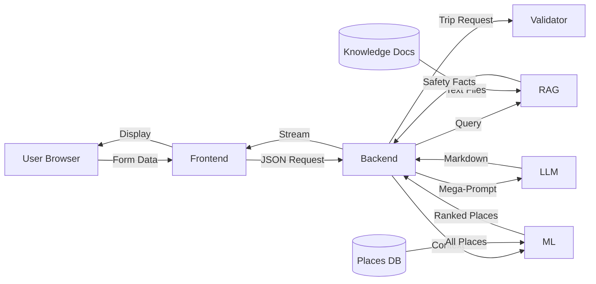

# Data Flow and Inputs: Who Reads What From Where

This document provides a complete mapping of data flow through the TripSync system, answering the critical question: **"Who takes input from where?"**

---

## Overview: The Information Highway



---

## Component Input/Output Table

| Component | Input Source | Input Type | Output | Next Consumer |
|-----------|--------------|-----------|---------|---------------|
| **User** | Browser form | User actions | Form data (source, destination, budget, people, days, preferences) | Frontend |
| **Frontend** | User | JSON | HTTP POST request | Backend API |
| **Backend Orchestrator** | Frontend | JSON | Parsed request object | Validator |
| **Validator** | Backend | `{budget, people, days}` | `{isValid, errors, suggestions}` | Backend (decision point) |
| **Backend** (if valid) | Validator | Pass/Fail + Mappls API | Destination coordinates | ML + RAG |
| **ML Engine** | Backend | `{preferences, user_lat, user_lon, budget, days}` + Places Database | `{recommendations[], itinerary{}}` | Backend |
| **RAG Engine** | Backend | Query string (`"Safety for {dest}"`) + Knowledge Docs | `{answer, sources[]}` | Backend |
| **Prompt Builder** | Backend | ML results + RAG facts + User request | Mega-prompt text | LLM Service |
| **LLM Service** | Prompt Builder | Mega-prompt | Streamed markdown tokens | Backend |
| **Backend** | LLM | Markdown stream | HTTP response (SSE) | Frontend |
| **Frontend** | Backend | Markdown stream | Rendered HTML | User (browser display) |

---

## Detailed Data Flow by Stage

### Stage 1: User Input Collection

**Input Source**: User's keyboard/mouse

**Data Fields**:
```json
{
  "source": "Pune",
  "destination": "Mahabaleshwar",
  "budget": "5000",
  "people": "2",
  "days": "3",
  "preferences": "Nature, Adventure"
}
```

**Output**: HTTP POST to `/api/plan-trip`

**File**: `public/app.js` (form submission handler)

---

### Stage 2: Backend Receives Request

**Input Source**: Frontend (HTTP POST)

**Processing**:
```javascript
app.post('/api/plan-trip', async (req, res) => {
  const { source, destination, budget, people, days, preferences } = req.body;
  
  // Parse and clean
  const userContext = {
    budget: parseFloat(budget),
    people: parseInt(people),
    days: parseInt(days),
    preferences: preferences.split(',').map(p => p.trim())
  };
  
  // Send to validator...
});
```

**Output**: Cleaned request object

**File**: `server.js`

---

### Stage 3: Validation

**Input Source**: Backend orchestrator

**Input Data**:
```javascript
{
  budget: 5000,      // Number
  people: 2,         // Number
  days: 3            // Number
}
```

**Processing** (`services/validation/tripValidator.js`):
```javascript
function validateTrip(request) {
  const minFood = people × days × 3 × 200;
  const minStay = people × days × 500;
  const minTravel = days × 2 × 300 × people;
  const minTotal = minFood + minStay + minTravel;
  
  if (budget < minTotal) {
    return { isValid: false, errors: [...], suggestions: {...} };
  }
  
  return { isValid: true };
}
```

**Output**:
```javascript
// Success case
{ isValid: true }

// Failure case
{
  isValid: false,
  errors: ["Budget of ₹5000 is too low..."],
  suggestions: { min_budget: 11600 }
}
```

**Next Consumer**:
- If `isValid: false` → Frontend (400 error)
- If `isValid: true` → Continue to Context Gathering

---

### Stage 4: Context Gathering

**Input Sources**: Multiple

#### 4A: Destination Coordinates

**Source 1**: Local Database (`data/database.json`)

**Process**:
```javascript
const allPlaces = JSON.parse(fs.readFileSync('./data/database.json'));
const localDest = allPlaces.find(p => p.place_name === destination);

if (localDest && localDest.lat) {
  coords = { lat: localDest.lat, lon: localDest.lon };
}
```

**Source 2 (Fallback)**: Mappls Geocoding API

**Process**:
```javascript
const response = await axios.get(`https://atlas.mappls.com/api/...geocode/${destination}`);
coords = { lat: response.data.lat, lon: response.data.lon };
```

**Output**:
```javascript
{ lat: 17.924, lon: 73.658 }
```

---

#### 4B: RAG Query

**Input Source**: Backend constructs query

**Input to RAG**:
```javascript
const query = `Travel rules and safety for ${destination} in Maharashtra`;
```

**RAG Processing** (`services/rag/queryRag.js`):
```javascript
const vectorStore = await getVectorStore();
const results = await vectorStore.similaritySearch(query, 3);

return {
  answer: results.map(r => r.text).join(' '),
  sources: results.map(r => r.metadata.source)
};
```

**Data Read**: Knowledge documents from `services/rag/knowledge_docs/`
- `safety.txt`
- `seasons.txt`
- `temple_rules.txt`

**Output**:
```javascript
{
  answer: "Heavy rainfall from June-Sept. Temples require modest dress...",
  sources: ["seasons.txt", "temple_rules.txt"]
}
```

**Next Consumer**: Backend (stores for later prompt building)

---

### Stage 5: ML Recommendation

**Input Source**: Backend orchestrator

**Input to ML** (via subprocess):
```javascript
const mlInput = {
  preferences: "Nature, Adventure",
  user_lat: 17.924,
  user_lon: 73.658,
  budget: 5000,
  days: 3
};

const pythonProcess = spawn('python', [
  'ml_engine/run_recommendations.py',
  JSON.stringify(mlInput),
  JSON.stringify(allPlaces)
]);
```

**ML Processing** (`ml_engine/recommender.py`):

**Data Read**: Places database (passed from Node.js)

**Processing Steps**:
1. **TF-IDF**: Calculate preference similarity for each place
2. **Haversine**: Calculate distance from destination
3. **Budget/Time**: Check feasibility
4. **Composite Score**: Weighted sum
5. **Sort**: Top 15 places
6. **K-Means**: Cluster into `days` groups

**Output**:
```json
{
  "recommendations": [
    {
      "place_id": "P123",
      "name": "Pratapgad Fort",
      "ml_score": 0.933,
      "scores": {
        "preference": 0.87,
        "distance": 0.95,
        "budget": 1.00,
        "time": 1.00
      }
    },
    ...14 more
  ],
  "itinerary": {
    "1": ["P123", "P124", "P128"],
    "2": ["P130", "P132"],
    "3": ["P140"]
  }
}
```

**Next Consumer**: Backend (prompt builder)

---

### Stage 6: Prompt Construction

**Input Sources**:
- User request (original form data)
- ML results (recommendations + itinerary)
- RAG facts (safety information)
- Context (coordinates, distance)

**Processing** (`services/prompt.builder.js`):
```javascript
function buildPrompt(user, rankedPlaces, mlItinerary, ragContext) {
  let prompt = `
SYSTEM ROLE:
You are a travel expert for Maharashtra.

USER REQUEST:
- Source: ${user.source}
- Destination: ${user.destination}
- Budget: ₹${user.budget} (VALIDATED)
- People: ${user.people}
- Days: ${user.days}
- Preferences: ${user.preferences}

ML-SELECTED PLACES (DO NOT MODIFY):
`;

  // Format day-wise structure
  for (const [day, placeIds] of Object.entries(mlItinerary)) {
    prompt += `\nDay ${day}:\n`;
    placeIds.forEach(id => {
      const place = rankedPlaces.find(p => p.place_id === id);
      prompt += `  - ${place.name} (Score: ${place.ml_score})\n`;
    });
  }

  prompt += `\nRAG-VERIFIED SAFETY INFO:\n${ragContext}\n`;
  
  prompt += `\nCONSTRAINTS:\n`;
  prompt += `1. ONLY recommend places listed above\n`;
  prompt += `2. Keep day-wise grouping shown\n`;
  prompt += `3. Format as markdown\n`;
  
  return prompt;
}
```

**Output**: Mega-prompt string (~800-1200 characters)

**Next Consumer**: LLM Service

---

### Stage 7: LLM Generation

**Input Source**: Prompt Builder

**Input**:
```
(800-1200 character mega-prompt with constraints)
```

**Processing** (`services/llm.service.js`):
```javascript
async function generateItinerary(prompt) {
  const response = await fetch('https://openrouter.ai/api/v1/chat/completions', {
    method: 'POST',
    headers: {
      'Authorization': `Bearer ${process.env.OPENAI_API_KEY}`,
      'Content-Type': 'application/json'
    },
    body: JSON.stringify({
      model: 'openai/gpt-4o-mini',
      messages: [{ role: 'user', content: prompt }],
      stream: true
    })
  });
  
  // Return streaming response
  return response.body;
}
```

**External API Call**: OpenRouter → GPT-4o-mini

**Output**: Streamed markdown tokens

**Next Consumer**: Backend (streaming relay)

---

### Stage 8: Backend Streaming

**Input Source**: LLM Service

**Input**: Token stream

**Processing** (`server.js`):
```javascript
res.setHeader('Content-Type', 'text/event-stream');

for await (const chunk of llmStream) {
  const token = parseToken(chunk);
  res.write(`data: ${token}\n\n`);
}

res.end();
```

**Output**: Server-Sent Events (SSE) to frontend

**Next Consumer**: Frontend

---

### Stage 9: Frontend Display

**Input Source**: Backend (SSE stream)

**Processing** (`public/app.js`):
```javascript
const eventSource = new EventSource('/api/plan-trip');

eventSource.onmessage = (event) => {
  const token = event.data;
  outputDiv.innerHTML += token;
};

eventSource.onerror = () => {
  eventSource.close();
};
```

**Output**: Rendered HTML in browser

**Next Consumer**: User (human)

---

## Data Storage Locations

| Data Type | Storage Location | Format | Access Pattern |
|-----------|-----------------|--------|----------------|
| **Places** | `data/database.json` | JSON | Read by ML Engine |
| **Knowledge Docs** | `services/rag/knowledge_docs/*.txt` | Plain Text | Read by RAG Loader |
| **Vector Embeddings** | In-memory (runtime) | Array of Objects | Created at startup, queried at runtime |
| **User Request** | HTTP POST body | JSON | Temporary (per-request) |
| **ML Results** | Python subprocess output | JSON | Temporary (per-request) |
| **LLM Output** | Streamed (not stored) | Markdown | Temporary (per-request) |

**Note**: TripSync does NOT persist user trips. All data is per-request.

---

## External API Dependencies

| API | Purpose | Data Consumed | Data Provided |
|-----|---------|--------------|---------------|
| **Mappls Geocoding** | Get destination coordinates | Destination name | `{lat, lon}` |
| **Mappls Directions** | Calculate travel distance | Source + destination | `{distance, duration}` |
| **OpenAI Embeddings** | Vectorize text | Text chunk | 1536-dimensional vector |
| **OpenRouter (GPT)** | Generate narrative | Mega-prompt | Markdown itinerary |

---

## Who Decides What: Decision Boundary Table

| Decision | Who Decides | Input From | Output To |
|----------|-------------|-----------|-----------|
| **Is trip logistically possible?** | Validator | Backend (parsed request) | Backend (Pass/Fail) |
| **Which places to visit?** | ML Engine | Backend (context) + Places DB | Backend (ranked list) |
| **How to group places into days?** | ML Engine (K-Means) | ML (top places + coords) | Backend (itinerary object) |
| **What are the safety rules?** | RAG Engine | Knowledge Docs | Backend (fact snippets) |
| **How to write the narrative?** | LLM | Prompt Builder | Backend (markdown) |
| **What to display to user?** | Frontend | Backend (SSE stream) | Browser DOM |

---

## Who Does NOT Decide What

| Forbidden Decision | Who Is NOT Allowed | Who Should Decide |
|--------------------|-------------------|-------------------|
| **Budget validation** | LLM | Validator (math formulas) |
| **Place selection** | LLM | ML (scoring algorithm) |
| **Day grouping** | LLM | ML (K-Means clustering) |
| **Safety facts** | LLM | RAG (knowledge retrieval) |
| **Final output formatting** | Validator/ML/RAG | LLM (language generation) |

---

## Data Transformation Chain

```
User Form
  ↓ (JSON serialization)
HTTP POST {source, destination, budget, people, days, preferences}
  ↓ (Parsing + type conversion)
Cleaned Object {budget: Number, people: Number, ...}
  ↓ (Math validation)
Validation Result {isValid: Boolean, errors: Array, suggestions: Object}
  ↓ (If valid: lookup + API calls)
Context {coords: {lat, lon}, ragFacts: String}
  ↓ (ML processing)
ML Results {recommendations: Array, itinerary: Object}
  ↓ (Prompt assembly)
Mega-Prompt (String ~1000 chars)
  ↓ (LLM API call)
Token Stream (Markdown)
  ↓ (SSE streaming)
Browser Display (HTML)
```

---

## Summary

**Data Flow Principle**: Each agent reads from **specific, curated sources** and outputs to **specific consumers**. No agent has full access to everything—**separation of concerns** ensures:
1. **Validation** reads user numbers, calculates with formulas
2. **ML** reads preferences + places database, calculates with algorithms
3. **RAG** reads knowledge documents, retrieves with vector search
4. **LLM** reads mega-prompt, generates with language model

**Result**: Clean, auditable data flow with no ambiguity about "who knows what from where."
