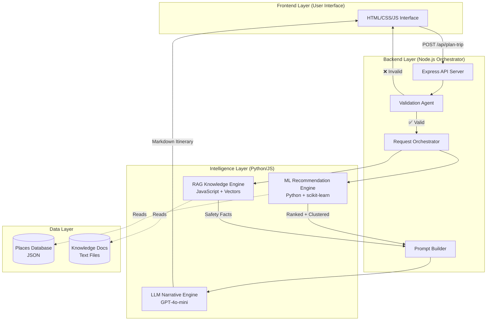
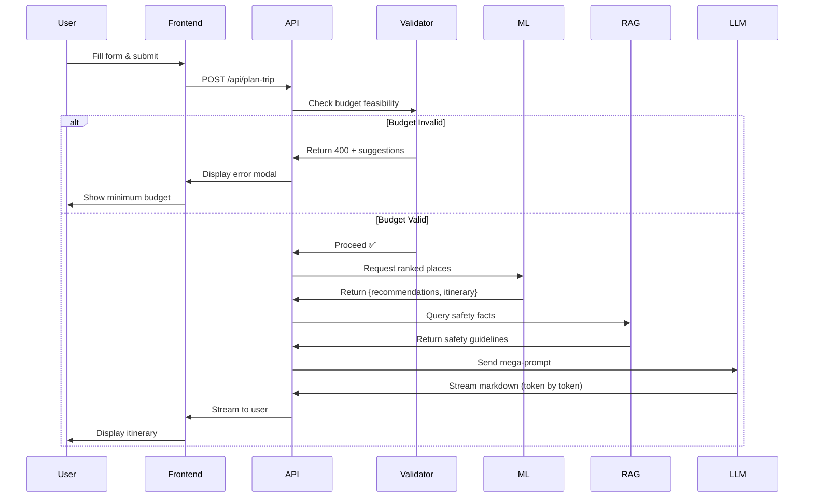

# System Architecture: TripSync AI

## High-Level Architecture

TripSync is built as a **layered multi-agent system** where each layer has specific responsibilities. The system is designed with the principle: **"Intelligence is distributed, control is centralized."**



---

## Component Breakdown

### 1. Frontend Layer: User Interface

**Technology**: HTML5, Vanilla JavaScript, CSS3

**Responsibilities**:
- Collect user input (source, destination, budget, people, days, preferences)
- Display validation errors with suggestions
- Stream LLM-generated itinerary in real-time
- Show interactive map with Mappls SDK

**What it does NOT do**:
- ❌ No client-side validation (all validation on server)
- ❌ No AI logic (purely presentational)
- ❌ No data storage (stateless)

**Key Files**:
- `public/index.html` - Form interface
- `public/app.js` - API calls and UI updates
- `public/styles.css` - Styling and animations

---

### 2. Backend Layer: Node.js Orchestrator

**Technology**: Node.js 18+ with Express.js

**Role**: **Traffic Controller + Agent Coordinator**

Think of this as a **project manager** who:
- Receives requests from the user
- Delegates work to specialized agents
- Assembles final results
- Does NOT make intelligent decisions itself

#### 2A. Express API Server (`server.js`)

**Responsibilities**:
- Handle incoming HTTP requests
- Call validation agent
- Coordinate ML, RAG, LLM calls
- Stream responses to frontend

**Key Endpoint**:
```
POST /api/plan-trip
Input: { source, destination, budget, people, days, preferences }
Output: Streamed Markdown itinerary
```

#### 2B. Validation Agent (`services/validation/tripValidator.js`)

**Responsibilities**:
- Calculate minimum required budget
- Check people/days sanity limits
- Validate time feasibility
- Return structured errors + suggestions

**Technology**: Pure JavaScript math (no ML/AI)

**Example**:
```
Input: budget=1000, people=6, days=2
Output: {
  isValid: false,
  errors: ["Budget too low"],
  suggestions: { min_budget: 6900 }
}
```

#### 2C. Prompt Builder (`services/prompt.builder.js`)

**Responsibilities**:
- Format ML recommendations into structured text
- Inject RAG safety facts
- Add LLM constraints ("You may ONLY recommend these places...")
- Build the final mega-prompt

**Output**: A 500-1000 word instruction for the LLM

---

### 3. Intelligence Layer

This is where **actual AI decisions** are made. Three separate agents:

#### 3A. ML Recommendation Engine (Python)

**Technology**: Python 3.10, scikit-learn, pandas, NumPy

**Why Python?**
- Industry standard for ML
- scikit-learn has battle-tested TF-IDF and K-Means implementations
- NumPy handles matrix operations efficiently

**Location**: `ml_engine/` directory

**Key Files**:
- `recommender.py` - Main ranking and clustering logic
- `clustering.py` - K-Means geographic clustering
- `run_recommendations.py` - CLI interface for Node.js

**Responsibilities**:
1. **Feature Engineering**: Calculate scores for each place
   - Preference Match (TF-IDF similarity)
   - Distance Feasibility (Haversine formula)
   - Budget Compatibility
   - Time Feasibility
   - Diversity Penalty (avoid recommending 5 forts in a row)

2. **Ranking**: Combine features into composite score

3. **Clustering**: Group top 15 places into geographic clusters (days)

**Input** (from Node.js):
```json
{
  "preferences": "Adventure, Nature",
  "user_lat": 18.5,
  "user_lon": 73.8,
  "budget": 5000,
  "days": 3
}
```

**Output**:
```json
{
  "recommendations": [
    {"place_id": "P123", "name": "Sinhagad Fort", "ml_score": 0.87}
  ],
  "itinerary": {
    "1": ["P123", "P124"],
    "2": ["P130"],
    "3": ["P145"]
  }
}
```

**What it does NOT do**:
- ❌ Does not generate text descriptions
- ❌ Does not make budget decisions (only uses them as input)
- ❌ Does not interact with the user

---

#### 3B. RAG Knowledge Engine (JavaScript)

**Technology**: JavaScript (Node.js), OpenAI Embeddings API

**Why JavaScript?**
- Integrates seamlessly with Node.js server
- Async I/O perfect for API calls
- No need for Python overhead for simple vector search

**Location**: `services/rag/` directory

**Key Files**:
- `vectorStore.js` - Vector embeddings and similarity search
- `loader.js` - Load and chunk text files
- `queryRag.js` - Query interface
- `knowledge_docs/` - Text files (safety.txt, seasons.txt, temple_rules.txt)

**Responsibilities**:
1. **Ingestion** (on server startup):
   - Load text files from `knowledge_docs/`
   - Generate vector embeddings via OpenAI API
   - Store in-memory vector index

2. **Retrieval** (during trip planning):
   - Convert user query to vector
   - Find top-k most similar documents
   - Return relevant text snippets

**Example**:
```
Query: "Safety rules for Mahabaleshwar"
Output: "Heavy rainfall warning: Carry varied clothing. 
         Temples require modest dress."
```

**Data Source**:
- Curated knowledge extracted from Official Tourism PDFs & API Reports
- Stored locally for instant retrieval

**What it does NOT do**:
- ❌ Does not rank places (that's ML's job)
- ❌ Does not generate new information (retrieval only)
- ❌ Does not interact with LLM directly

---

#### 3C. LLM Narrative Engine

**Technology**: GPT-4o-mini via OpenRouter API

**Why GPT-4o-mini?**
- Cost-effective ($0.15 per 1M tokens)
- Fast response times
- Good at markdown formatting
- Supports streaming

**Location**: `services/llm.service.js`

**Responsibilities**:
- Convert structured data into natural language
- Format output as markdown
- Add transitions and storytelling elements
- Stream output token-by-token for better UX

**Critical Constraint**:
> The LLM is **strictly forbidden** from:
> - Suggesting places not in the ML-provided list
> - Making budget calculations
> - Deciding which days to visit which places
> - Generating safety information

**What the LLM CAN do**:
- ✅ Rephrase "Place: Sinhagad Fort, Score: 0.87" as "Begin your adventure at the historic Sinhagad Fort..."
- ✅ Add connecting phrases like "After exploring the fort, head to..."
- ✅ Format output with headers, lists, emoji

**What the LLM CANNOT do**:
- ❌ Add new places not in the list
- ❌ Change the day-wise grouping
- ❌ Invent safety rules

---

### 4. Data Layer

#### 4A. Places Database

**Format**: JSON file (`data/database.json`)

**Schema**:
```json
{
  "place_id": "P123",
  "place_name": "Sinhagad Fort",
  "category": "Historical",
  "description": "13th century hill fortress",
  "lat": 18.366,
  "lon": 73.755,
  "cost_level": "Low"
}
```

**Size**: ~500 places in Maharashtra

**Why JSON?**
- Academic project, no need for database overhead
- Fast read access
- Easy to version control
- Portable

#### 4B. Knowledge Documents

**Format**: Plain text files (`.txt`)

**Location**: `services/rag/knowledge_docs/`

**Files**:
- `safety.txt` - Safety tips for Maharashtra tourism
- `seasons.txt` - Best time to visit, weather patterns
- `temple_rules.txt` - Cultural etiquette for religious sites

**Source**: Curated from official tourism PDFs and verified sources

**Why Text Files?**
- Simple to edit and update
- RAG engine processes them on startup
- No external database required

---

## Separation of Responsibilities

### Why Node.js is an Orchestrator, Not an Intelligence Engine

**Node.js is good at**:
- Handling concurrent HTTP requests
- Managing async I/O operations
- Coordinating between services
- Streaming responses

**Node.js is NOT good at**:
- Heavy matrix computations (TF-IDF, cosine similarity)
- Scientific computing
- ML model training

**Therefore**: Node.js **coordinates**, Python **computes**.

---

### Why Python Handles ML

**Python ecosystem offers**:
- scikit-learn (mature ML library)
- NumPy (fast numerical operations)
- pandas (data manipulation)
- Industry-standard for ML interviews and projects

**Communication**: Node.js spawns Python subprocess, passes JSON, receives JSON output.

---

## Data Flow Summary



---

## Technology Stack Justification

| Component | Technology | Why This Choice? |
|-----------|-----------|------------------|
| **Frontend** | Vanilla JS | No framework overhead, fast load times, easy debugging |
| **Backend** | Node.js + Express | Async I/O, streaming support, JavaScript ecosystem |
| **Validation** | Pure JS math | No need for AI/ML, deterministic, instant |
| **ML Engine** | Python + scikit-learn | Industry standard, interview-grade, mature libraries |
| **RAG** | JS + OpenAI Embeddings | Seamless integration with Node, modern RAG approach |
| **LLM** | GPT-4o-mini | Cost-effective, quality output, streaming support |
| **Database** | JSON files | Academic simplicity, version control friendly |

---

## Scalability Considerations

### Current Limitations (Academic Scope)
- In-memory vector store (limited to ~10,000 documents)
- JSON file database (not for production)
- Single server deployment

### Production Path (if deployed)
- Replace JSON with PostgreSQL/MongoDB
- Use FAISS/Pinecone for vector storage
- Add Redis for caching
- Containerize with Docker
- Load balance with NGINX

**For this academic project**: Current architecture is appropriate.

---

## Security Architecture

### API Key Management
- Environment variables for sensitive keys
- Never commit `.env` to version control
- Use OpenRouter for abstracted LLM access

### Input Validation
- All inputs sanitized on server
- Budget/people/days type-checked
- No SQL injection risk (using JSON, not SQL)

### Rate Limiting
- (Future enhancement) Add express-rate-limit middleware

---

## Summary

TripSync's architecture demonstrates:
1. **Proper separation of concerns** (UI, orchestration, intelligence, data)
2. **Technology selection based on strengths** (Node for I/O, Python for ML)
3. **Defensive design** (validation before processing, LLM constraints)
4. **Academic appropriateness** (simple data layer, focus on AI logic)

The system is **NOT** built for enterprise scale—it's built to **demonstrate multi-agent AI principles** in a clear, auditable way.
